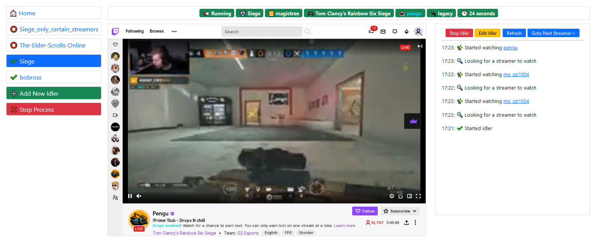
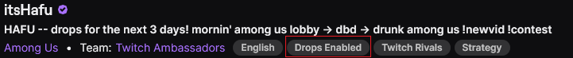
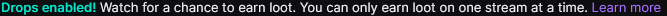
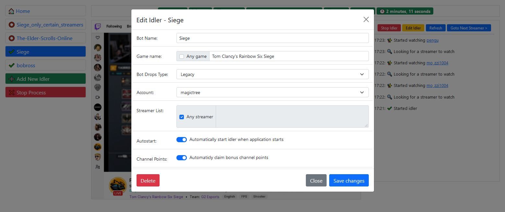

# twitch-drops-lurker

## Info
This is a "<b>work in progress</b>" fork of NiciusB/twitch-drops-lurker. 

This allows you to idle twitch headless without having an additional window open.

## Requirements
- Google Chrome / Chromium (Other Chromium based browsers such as Brave may work, but are not supported)
- EditThisCookie chrome extension
- Node.js / npm

## Installation

1. Clone the repository to your device with `git clone https://github.com/mt025/twitch-drops-lurker.git`
2. Install npm depencencies. First go to the downloaded folder `cd twitch-drops-lurker`, then run `npm install`
3. Edit the index.js to specify chrome path. 
4. Create a `accountname_localStorage.json` file in `./userlogins`. For the content, run `copy(Object.entries(localStorage))` in the console when having twitch.tv open. This will fill your clipboard and you can paste it directly into `accountname_localStorage.json`. This can be done for mutiple accounts if desired
5. Create a `accountname_cookies.json` file in `./userlogins`. Some of the cookies are not accesible from javascript, so you'll need to export them using the extension EditThisCookie
6. Start the node process. You can run `node index.js`
7. Use the web interface to create idlers

## Creating idlers using the web interface
- <b>Name</b> - Name of the idler only use `(A-Z,a-z,0-9,_,-)`, no spaces
- <b>Game Name</b> - Name of the game you wish to idle. Check the box to idle any game. Used for search and to validate the streamer is still playing the specified game. Names should be as they appear on twitch. e.g. `Tom Clancy's Rainbow Six Siege`
- <b>Idler Drops Type</b> - Used to make sure you are still watching a stream that is dropping
	- New: for games tagged as 'drops enabled' 
	- Legacy: Older style without tag but with a message under the stream: 
	- None: Ignore drop status
- <b>Account</b> - Selected account to use to idle for this idler as created in step 4-5 above
- <b>Streamer list</b> - A list of stramer names to idle, rather than finding a random streamer, split by new line
- <b>Autostart</b> - Automatically start when the node process is started
- <b>Channel Points</b> - Automatically claim channel points

## Node options
* `node index.js` for default operations
* `node index.js 5005` to select a port
* `node index.js 5005 false` to run in headed mode

## Deploying
We recommend using a tool like `pm2` to manage your node process. It will automatically launch on boot, recover from errors, and save logs and crashes to disk.

